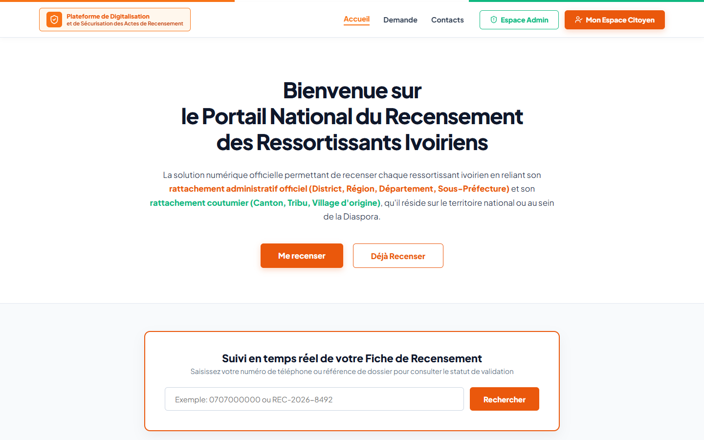
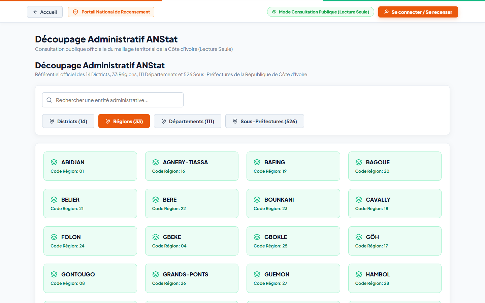
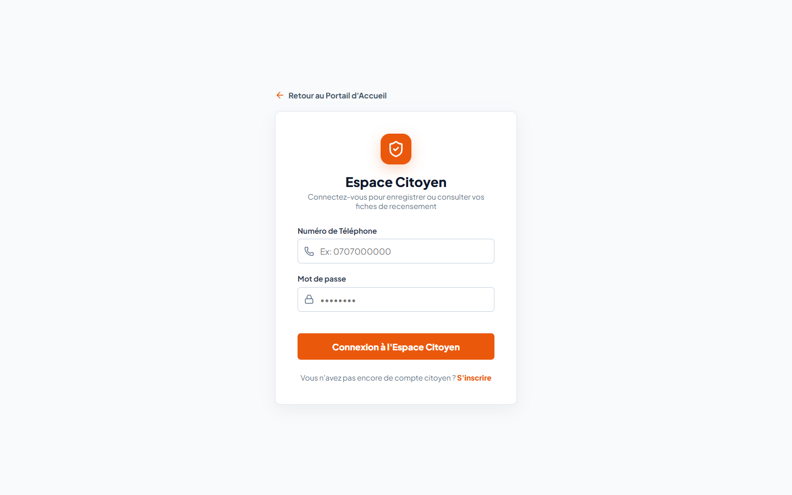
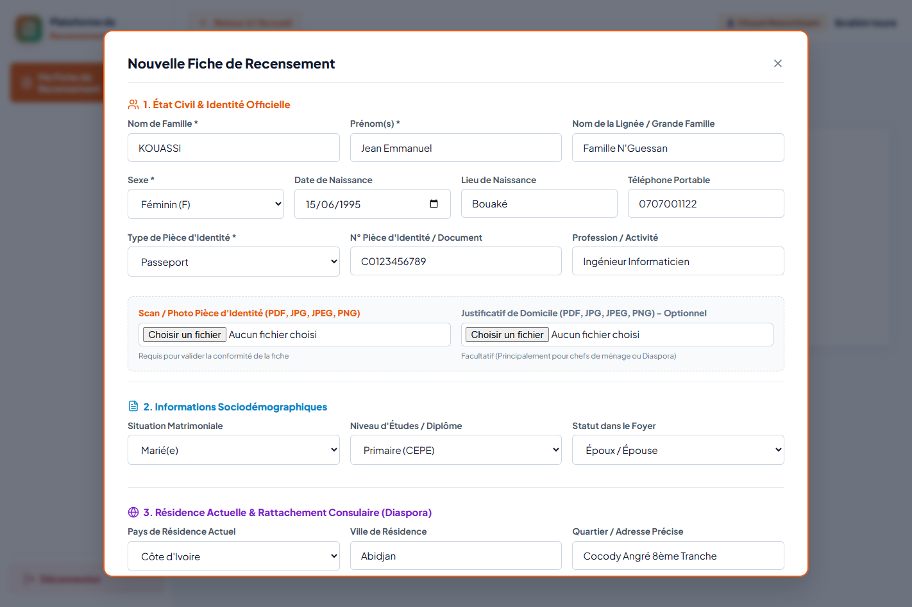
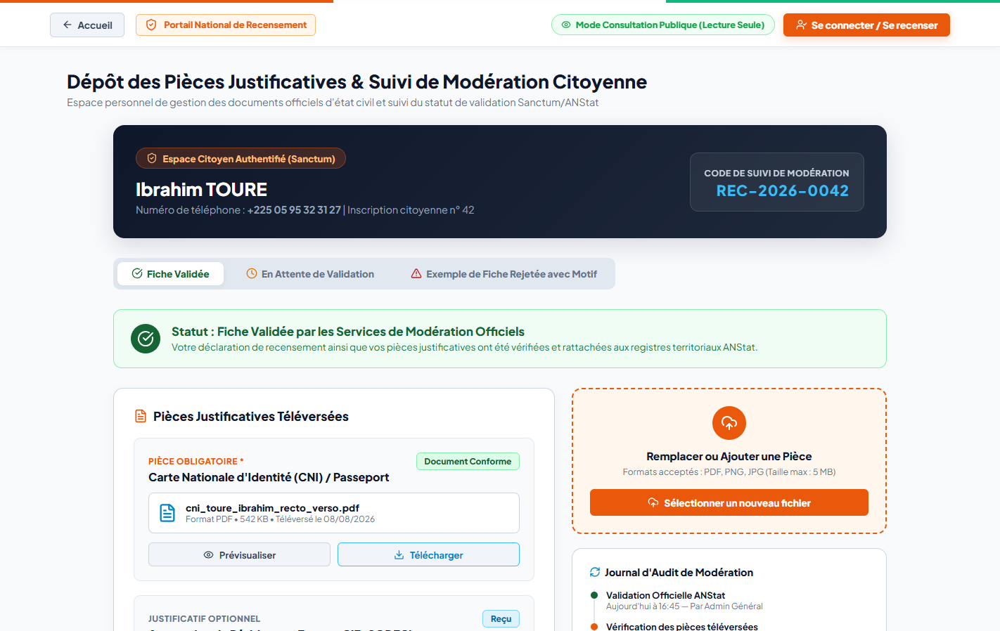
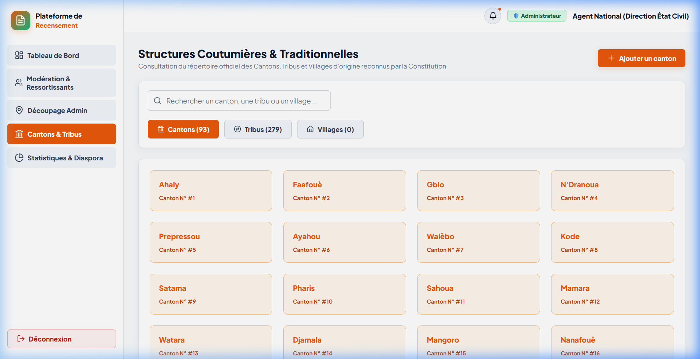

# CHAPITRE VII — PRÉSENTATION DES RÉSULTATS

---

Ce chapitre présente les interfaces réalisées à l'issue du développement de la plateforme de recensement unifiée des ressortissants ivoiriens. Les écrans sont organisés selon un ordre logique et chronologique correspondant au parcours de l'utilisateur à travers les trois modules fondamentaux définis dans le cahier des charges : le **Portail Public** (accessible à tous pour l'information et la consultation des territoires), l'**Espace Ressortissant / Citoyen** (réservé aux usagers authentifiés pour la saisie de leur fiche et le dépôt des pièces justificatives) et la **Console d'Administration et Modération** (dédiée au personnel gestionnaire de l'État pour le contrôle et le pilotage). Chaque interface est accompagnée d'une description fonctionnelle explicitant les choix de conception et les fonctionnalités offertes à l'utilisateur.

---

## I. Présentation des interfaces clés du système par modules

### A. Module 1 : Portail Public & Vitrine Institutionnelle (Accès tout public)

#### 1. Page d'accueil (Home / Portail Public)

La page d'accueil constitue la vitrine institutionnelle de la plateforme. Elle présente les objectifs du recensement national, sensibilise les citoyens résidant en Côte d'Ivoire ainsi que la Diaspora, et donne un accès direct aux démarches en ligne.

*Figure VII.1 — Page d'accueil du portail national de recensement*

- **Description fonctionnelle** : Développée en **React SPA** et stylisée avec **Tailwind CSS**, cette page vitrine réactive permet au citoyen d'accéder en un clic au formulaire de recensement, d'explorer le découpage territorial officiel ou de consulter les statistiques globales du pays.

---

#### 2. Consultation du référentiel territorial (Découpage ANStat)

Cette interface permet de consulter l'intégralité du découpage administratif officiel de la Côte d'Ivoire importé automatiquement depuis les services de l'ANStat.

*Figure VII.2 — Interface d'exploration du référentiel territorial officiel*

- **Description fonctionnelle** : L'usager peut naviguer interactivement au sein des **14 Districts**, **33 Régions**, **111 Départements** et **526 Sous-Préfectures**. La recherche réactive et l'actualisation dynamique des listes s'effectuent via le client HTTP **Axios**, garantissant une consultation instantanée sans rechargement de page.

---

### B. Module 2 : Authentification & Espace Ressortissant (Citoyen)

#### 3. Page de connexion & Authentification

La page de connexion est le point de passage obligatoire pour accéder à l'espace personnel citoyen et à la console d'administration.

*Figure VII.3 — Interface de connexion et authentification Sanctum*

- **Description fonctionnelle** : L'usager saisit son identifiant (adresse e-mail ou numéro de téléphone) et son mot de passe. La requête est transmise à l'API Laravel (`/api/login`), qui vérifie les identifiants et génère un jeton d'authentification **Laravel Sanctum** (*Bearer Token*) stocké côté client pour sécuriser les appels ultérieurs.

---

#### 4. Formulaire de recensement citoyen (Fiche individuelle)

Cette écran représente le cœur fonctionnel du système. Il permet à chaque citoyen ivoirien d'enregistrer sa déclaration individuelle de recensement.

*Figure VII.4 — Interface de saisie de la fiche individuelle de recensement*

- **Description fonctionnelle** : Le formulaire réactif guide l'usager à travers 4 sections thématiques :
  1. **État civil et sociodémographie** : Saisie du nom, prénom, sexe, date/lieu de naissance, profession, situation matrimoniale et niveau d'étude.
  2. **Ancrage administratif officiel (ANStat)** : Filtre réactif en cascade (sélection obligatoire du District ➔ Région ➔ Département ➔ Sous-Préfecture).
  3. **Origines coutumières** : Sélection optionnelle du Canton, de la Tribu et du Village d'origine.
  4. **Domiciliation & Diaspora** : Déclaration de la résidence effective (locale ou à l'étranger avec l'indication du Consulat de rattachement et d'un contact référent).

---

#### 5. Dépôt des pièces justificatives et suivi de modération

Cet espace permet au citoyen de joindre ses documents justificatifs originaux et de suivre l'avancement du traitement de son dossier par l'administration.

*Figure VII.5 — Gestion des pièces d'identité et suivi de modération dans l'espace citoyen*

- **Description fonctionnelle** : L'usager télécharge le scan de sa pièce d'identité (CNI, Passeport ou Carte consulaire) ainsi qu'un justificatif de domicile (optionnel). L'écran affiche le statut de modération (`en_attente`, `valide` ou `rejete`). En cas de rejet, le **motif explicatif** rédigé par le modérateur est affiché clairement pour guider le citoyen dans la mise à jour de sa fiche.

---

#### 6. Notifications et alertes citoyennes

Ce module assure le suivi informationnel de l'usager tout au long du cycle de vie de sa déclaration.

*(Emplacement pour l'image du screen : Notifications)*

*Figure VII.6 — Interface des notifications dans l'espace citoyen*

- **Description fonctionnelle** : L'écran liste l'ensemble des alertes transmises au citoyen (ex: confirmation d'enregistrement, validation définitive de la fiche ou demande de correction suite à un rejet).

---

### C. Module 3 : Console d'Administration & Modération (Gestionnaires de l'État)

#### 7. Tableau de bord Administrateur (Dashboard)

Le tableau de bord est la centrale d'analyse décisionnelle réservée aux autorités et aux administrateurs du système.

*(Emplacement pour l'image du screen : Tableau de bord Administrateur)*

*Figure VII.7 — Tableau de bord décisionnel administrateur*

- **Description fonctionnelle** : L'écran agrège et affiche en temps réel les indicateurs nationaux clés sous forme de cartes synthétiques et de graphiques interactifs : volume global de citoyennes et citoyens recensés, cartographie de la Diaspora par pays et consulat, répartition par tranche d'âge et niveau d'étude, et volume de fiches en attente de modération.

---

#### 8. Console de modération des déclarations

La console de modération est l'interface métier qui permet aux agents de l'État d'instruire et de valider les fiches de recensement transmises.

*(Emplacement pour l'image du screen : Console de modération)*

*Figure VII.8 — Interface de modération et validation des fiches de recensement*

- **Description fonctionnelle** : Les modérateurs parcourent la liste des fiches soumises, prévisualisent directement les scans de CNI et justificatifs via une fenêtre modale sécurisée, puis exécutent l'une des deux décisions d'administration :
  - **Valider** : Confirme la conformité de la fiche (`PATCH /api/ressortissants/{id}/valider`), l'intégrant officiellement dans les statistiques nationales.
  - **Rejeter** : Saisit obligatoirement un **motif de rejet** (`PATCH /api/ressortissants/{id}/rejeter`), notifiant le citoyen afin qu'il puisse soumettre une fiche conforme.

---

#### 9. Gestion du référentiel coutumier et des privilèges

Cette interface offre aux administrateurs les outils nécessaires pour maintenir le maillage coutumier et gérer la sécurité des accès.

*Figure VII.9 — Interface d'administration du référentiel coutumier et des rôles*

- **Description fonctionnelle** : Permet la création, la modification et la suppression (CRUD) des Cantons, Tribus et Villages d'origine. Elle assure également la gestion des comptes utilisateurs et l'attribution des rôles applicatifs (Administrateur, Modérateur, Citoyen).

---

## II. Synthèse de l'évaluation et conformité au Cahier des Charges

Pour mesurer l'efficacité globale de la solution, les modules présentés ci-dessus ont été évalués au regard des exigences fonctionnelles définies dans le cahier des charges (Chapitre III).

*Tableau VII.1 — Matrice d'évaluation et de conformité des exigences fonctionnelles*

| Réf. Exigence | Intitulé du Besoin Fonctionnel | Module Implémenté | Statut de Réalisation | Niveau de Conformité |
| :---: | :--- | :--- | :---: | :---: |
| **EF-01** | Ingestion automatique du découpage ANStat via CLI | Backend API | **Réalisé** | **100 % (Conforme)** |
| **EF-02** | Formulaire de recensement citoyen réactif (SPA React) | Espace Ressortissant | **Réalisé** | **100 % (Conforme)** |
| **EF-03** | Chargement dynamique des territoires en cascade | Portail / Espace Citoyen | **Réalisé** | **100 % (Conforme)** |
| **EF-04** | Prise en charge du double ancrage (Administratif & Coutumier) | Formulaire Recensement | **Réalisé** | **100 % (Conforme)** |
| **EF-05** | Dépôt et contrôle des pièces justificatives (CNI, Domicile) | Espace Ressortissant | **Réalisé** | **100 % (Conforme)** |
| **EF-06** | Recensement spécifique de la Diaspora (Consulats) | Formulaire / Stats | **Réalisé** | **100 % (Conforme)** |
| **EF-07** | Authentification sécurisée par jeton (Laravel Sanctum) | Authentification | **Réalisé** | **100 % (Conforme)** |
| **EF-08** | Console de modération (Validation / Rejet motivé) | Console Admin | **Réalisé** | **100 % (Conforme)** |
| **EF-09** | Tableau de bord et reporting statistique interactif | Dashboard Admin | **Réalisé** | **100 % (Conforme)** |

---

## III. Estimation financière du projet (TCO)

L'évaluation économique du projet repose sur la méthode du coût total de possession (*Total Cost of Ownership - TCO*). La solution étant entièrement développée à partir d'outils libres et open source (React, Laravel, SQLite, MySQL, Tailwind CSS), les frais d'acquisition de licences logicielles sont nuls.

*Tableau VII.2 — Estimation financière globale du projet (TCO)*

| Poste de Dépense | Nature du Coût | Montant Estimé (FCFA) | Montant Estimé (€) |
| :--- | :--- | :---: | :---: |
| **Poste de développement** | Matériel (Laptop Core i5, 12 Go RAM, SSD 512 Go) | 450 000 FCFA | 686 € |
| **Licences logiciels & Outils** | Outils Open Source (React, Laravel, VS Code, Git) | 0 FCFA | 0 € |
| **Hébergement Frontend (Vercel)** | Déploiement SPA React (Offre Starter) | 0 FCFA | 0 € |
| **Hébergement Backend & BD** | Serveur Cloud VPS (API Laravel & MySQL - 1 an) | 120 000 FCFA | 183 € |
| **Nom de domaine (.ci / .org)** | Domaine institutionnel officiel (1 an) | 15 000 FCFA | 23 € |
| **TOTAL GÉNÉRAL ESTIMÉ** | **Investissement & Fonctionnement Année 1** | **585 000 FCFA** | **892 €** |

---

## IV. Discussion, Limites et Perspectives

### 1. Discussion des résultats
L'implémentation de la plateforme apporte une réponse novatrice et robuste aux limites du recensement traditionnel :
- **Intégrité géographique irréprochable** grâce au raccordement direct avec le référentiel de l'ANStat.
- **Valorisation du maillage coutumier** permettant de préserver la mémoire des origines (Cantons, Tribus, Villages).
- **Inclusion de la Diaspora** grâce à l'accessibilité web et au rattachement par consulat.

### 2. Limites identifiées
- **Fracture numérique** : L'auto-recensement autonome nécessite la maîtrise d'un navigateur web et d'un smartphone ou ordinateur.
- **Dépendance réseau** : La soumission exige une connexion Internet active pour la transmission des pièces justificatives.

### 3. Perspectives d'évolution
- **Application mobile PWA hors-ligne (*Offline First*)** pour la collecte en zone rurale sans couverture réseau.
- **Profil d'Agent Recenseur** pour la saisie assistée sur le terrain.
- **Module d'authentification biométrique** pour renforcer la lutte contre les doublons et les fraudes d'identité.
